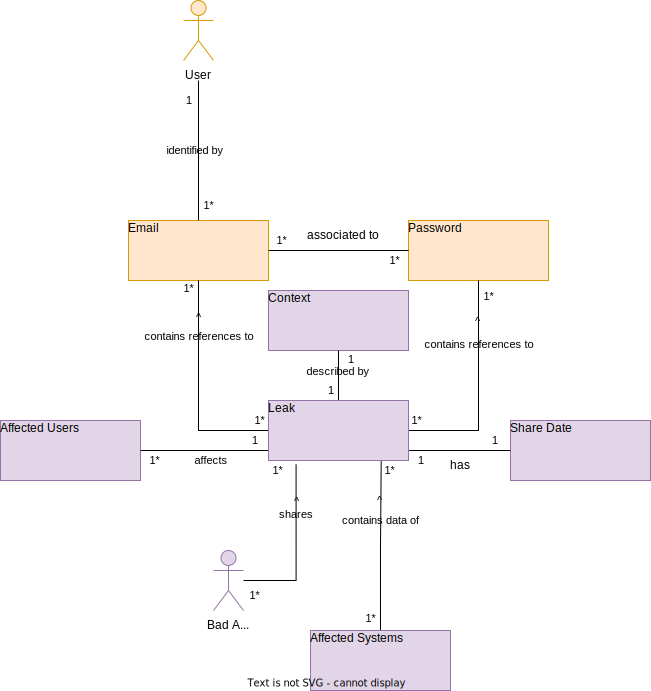

# entities

This file keeps track of all entities the system processes.

---

|Identifier|Scope|
|----------|-----|
|Email|`User`|
|Password|`User`|
|Context|`Leak`|
|Affected Users (Count)|`Leak`|
|Exposure Date|`Leak`|
|Affected Systems|`Leak`|

In the future, we would like to support more PII entities, to enrich the system value.

## Relationships

To further understand how entities relate to each other, the following domain model diagram is presented:

