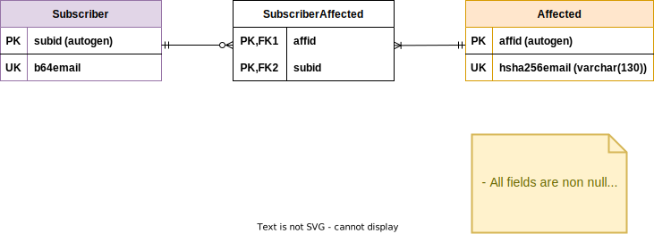

# subscribe-data-model

This file describes the relational data model that represents the system entities in the database of **subscribe** service.

---

Some design reasons we considered:

- Since e-mail is queryable, we store their hash and base64 value, to prevent **SQL Injections**. Right now we use the `SHA-256` cryptographic function, as no collisions have been found yet (and most likely won't ever be).
- We define auto-gen keys as primary keys instead of relying on domain identity keys. This is done to reduce database size, as primary keys are almost longer than 8 bytes, but long integer values are always 8 bytes each.

Note: We refer to generating the next available unique integer as `autogen` in the data model diagram, for primary key definition. Do not confuse with `AUTOINCREMENT` keyword from SQLite, we don't use it.

