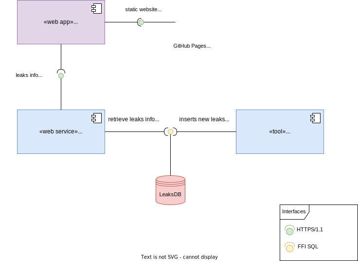

# system-communication

This file provides an overview of all the components the system composes and how they connect to each other. Please refer to the diagram below as an high-level picture of the system. We try to depict everything we use on this diagram, so everyone can fully understand the system data flows.

---

|Identifier|Scope|Description|
|----------|-----|-----------|
|palavrapasse|`Web App`|The web frontend that users use to query leaks information|
|santos|`Web Service`|Web API that serves the backend to the frontend. Primary level API that protects second level APIs of being exposed to attackers. A "Backend for Frontend" (BFF) service|
|query|`Web Service`|Query service that processes read/query operations requests|
|subscribe|`Web Service`|Command service that processes subscribe operations requests|
|paulo|`Web Service`|Command service that sends e-mails on request|
|import|`Tool`|Tool that imports leaks files, performs sanitization and inserts them in the database|
|LeaksDB|`Database`|Our beloved SQLite database that hoards leaks data|
|GitHub Pages|`CDN`|We use it to serve our webapp in a free manner, since it's a static website|
|dominios.pt|`DNS`|The domain registrar we use to configure domain resolution|

Note: All `HTTPS/1.1` communication is issued under [Let's Encrypt](https://letsencrypt.org/) certificates.

