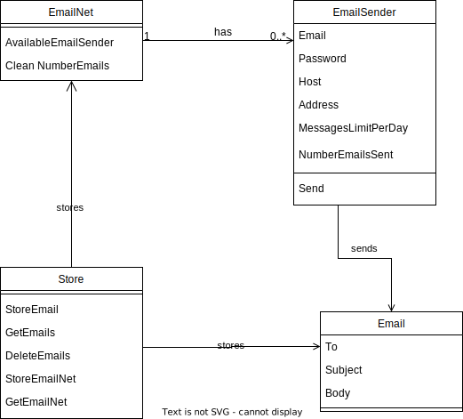

# paulo-design

---

## Serverless Paulo

The main goal of paulo is to send e-mails.

We first decided to make paulo serverless as a **cloud function**. The reasons for that are:

- We won't be sending e-mails all the time, and when we send, it will be in a "batch" mode, because e-mails are triggered by new leaks.
- Cloud functions are cold, meaning they are not constantly running like a service instance, so this results in fewer costs for us.

However, we faced some issues with sending e-mails with Gmail accounts when trying to set up the Cloudflare Worker:

1. We could use Google SDK in the worker, but the bundle size exceeds the size limit of the worker (`1MB`).
2. The other way is to communicate with the Google API, but there is no way to obtain the authentication token without the browser (OAuth 2.0), which is not available in workers.

Another approach would be to use a Microsoft API, but their pricing model is too *enterprise*.

With this being said, we changed the approach and decided that would be better to create a **go service**.

---

## Server Paulo

The main goal of paulo is to send e-mails, as mentioned before, however, Gmail establishes a [limit of e-mails](https://support.google.com/a/answer/166852?hl=en#zippy=) that can be sent per day (`500`).

To be able to send more e-mails per day we will support having more than one Gmail account. For each Gmail account, we will set a maximum of e-mails that can be sent and keep track of the number of e-mails sent in the day.

It is fundamental that the number of e-mails sent in the day is not lost whenever the service is restarted. In other words, this value should not only be stored in memory.

Even with having more than one Gmail account, we cannot overlap the limit of e-mails, so we must stop sending e-mails when this value is achieved. To not 'lost' e-mails that should have been sent we will store them and try to resend them later. This will be the responsibility of the [sender job](paulo-jobs.md#sender).

Every day we need to change the number of e-mails sent in the day to 0, and we have a job for that, the [resetter job](paulo-jobs.md#resetter).

Following is a class diagram to facilitate the undertanting of the concepts of this service:

