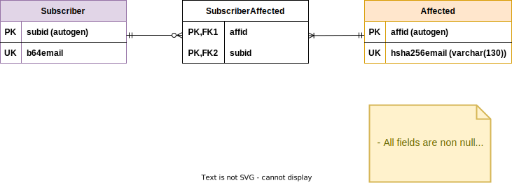

# subscribe-data-model

This file describes the relational data model that represents the **subscribe** service entities in the database.

---

Some design reasons we considered:

- Since the subscriber e-mail is introduced by the user, we encode it in `base64` to prevent **SQL Injections**. Also, since affected e-mails must exist in the `LeaksDB` database to trigger a notification, we are storing it's hash version (`SHA256`), which again prevents SQL injections.
- We define auto-gen keys as primary keys instead of relying on domain identity keys. This is done to reduce database size, as primary keys are almost longer than 8 bytes, but long integer values are always 8 bytes each.

Note: We refer to generating the next available unique integer as `autogen` in the data model diagram, for primary key definition. Do not confuse with `AUTOINCREMENT` keyword from SQLite, we don't use it.

